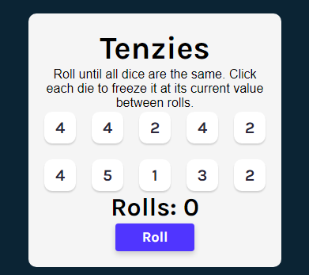

# Tenzies Game [January 6th 2023]

This project is one of the React solo projects from [Scrimba](https://scrimba.com/).

## Table of contents

- [Overview](#overview)
  - [Screenshot](#screenshot)
  - [Links](#links)
  - [Features](#features)
- [My process](#my-process)
  - [Built with](#built-with)
  - [What I learned](#what-i-learned)
  - [Continued development](#continued-development)
  - [Useful resources](#useful-resources)
- [Author](#author)
- [Acknowledgments](#acknowledgments)

## Overview

In this project, the goal was to build out the famous Tenzies game
and to make it fully functional.

### Screenshots

### Links

- Live Site URL: [Tenzies](https://fluffy-biscochitos-592d3e.netlify.app/)

### Features

- Get random numbers to choose from with every roll.
- Hold a number and continue rolling.
- Keep track of how many rolls it took before you won.

## My process

I started by looking at figma files and writing down the possible routes I can take in terms of setting up my files. I then strctured my HTML file, then i used the figma file to get the appropriate colors and sizing to set up my CSS file. Some of the logic that went into the Javascript file was apart of the challenge but most of it was me adding my own logic in an effort to make it trully my creation.

### Built with

- HTML
- CSS
- Javascript
- React

### What I learned

I learned how to work with state in a much more complex way and also
gained more knowledge on the useEffect hook.

### Continued development

In the future i would like to and a timer telling the user how long it took for them to win the game.

### Useful resources

- [Scrimba](https://scrimba.com//)

## Author

- Jaron Denzel Young

## Acknowledgments

Thank you, Scrimba, for being an awesome place to learn.
